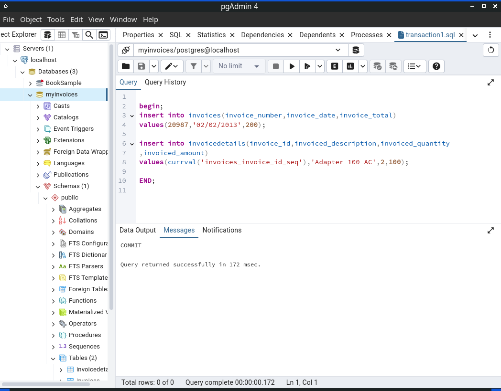
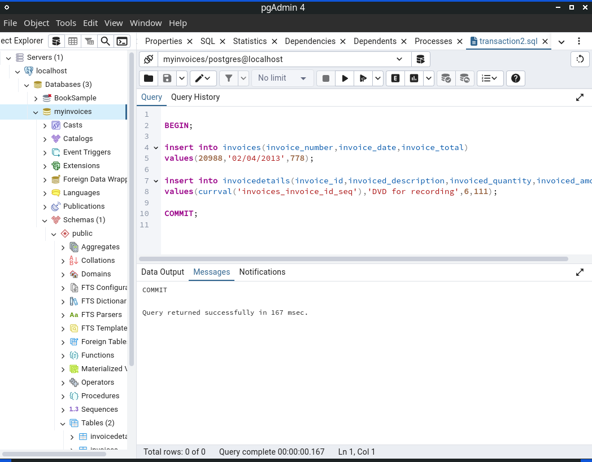

# Entendiendo Transacciones con PostgreSQL.

Hay operaciones en los sistemas de bases de datos (DBMS) que no pueden expresarse como una única operación SQL sino como el resultado de un conjunto de dos o más operaciones SQL, cuyo éxito depende de que cada una de esas operaciones se ejecute correctamente ya que si una de ellas falla se considera que toda la operación fallo. 
El control de transacciones es una característica fundamental de cualquier DBMS (como PostgreSQL,MS SQL Server ú Oracle) esto permite agrupar un conjunto de operaciones o enunciados SQL en una misma unidad de trabajo discreta , cuyo resultado no puede ser divisible ya que solo se considera el total de operaciones completadas, si hay una ejecución parcial el DBMS se encarga de revertir esos cambios para dejar la información consistente.

Una transacción tiene cuatro características esenciales conocidas como el acrónimo ACID:
<ul>
<li><b>Atomicity(Atomicidad):</b> Una transacción es una unidad atómica o se ejecutan las operaciones múltiples por completo o no se ejecuta absolutamente nada, cualquier cambio parcial es revertido para asegurar la consistencia en la base de datos.</li>
<li><b>Consistency (Consistencia):</b> Cuando finaliza una transacción debe dejar todos los datos sin ningún tipo de inconsistencia, por lo que todas las reglas  de integridad deben ser aplicadas a todos los cambios realizados por la transacción, o sea todas las estructuras de datos internas deben de estar en un estado consistente.</li>
<li><b>Isolation (Aislamiento o independencia):</b> Esto significa que los cambios de cada transacción son independientes de los cambios de otras transacciones que se ejecuten en ese instante, o sea que los datos afectados de una transacción no están disponibles para otras transacciones sino hasta que la transacción que los ocupa finalice por completo.</li>
<li><b>Durability (Permanencia):</b> Después de que las transacciones hayan terminado, todos los cambios realizados son permanentes en la base de datos incluso si después hay una caída del DBMS.</li>
</ul>

Las transacciones en <b>PostgreSQL</b> utilizan las siguientes palabras reservadas:  

<b>BEGIN:</b> Empieza la transacción
  

<b>SAVEPOINT [name]:</b>  Le dice al DBMS la localización de un punto de retorno en la transacción si una parte de la transacción es cancelada. El DBMS guarda el estado de la transacción hasta este punto. 
 

<b>COMMIT:</b> Todos los cambios realizados por las transacciones deben ser permanentes y accesibles a las demás operaciones del DBMS.
 

<b>ROLLBACK [savepoint]:</b> Aborta la actual transacción todos los cambios realizados deben ser revertidos.
  

Para poner en práctica estos comandos utilizaremos dos tablas relacionadas <i>Invoices</i> y <i>InvoiceDetails</i>.

 

Agregamos un par de registros, cada uno dentro de una transacción en el primer registro el commit (confirmación) se realiza de forma automática al terminar la transacción con el comando END.

En el segundo registro utilizamos el comando COMMIT de forma explicita para hacer los cambios permanentes.

Ahora insertamos un nuevo registro y eliminamos un par pero en vez de confirmar la transacción con COMMIT deshacemos los cambios y regresamos los registros a su estado original, utilizando ROLLBACK.

 

Aquí otro ejemplo del uso de ROLLBACK.
 

 

En el siguiente bloque de PL/SQL anónimo vamos a utilizar los comandos anteriores además del comando SAVEPOINT el cuál permite deshacer parcialmente los cambios hechos dentro de una transacción y no toda la transacción por completo.
Persistimos entonces solo los cambios antes del SAVEPOINT, los cambios realizados después serán revertidos por el comando ROLLBACK.

 
